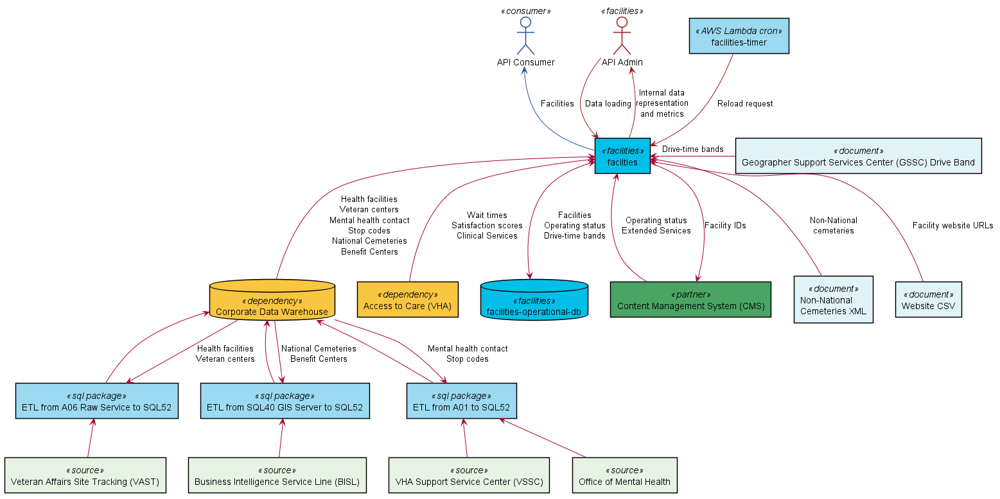

# lighthouse-facilities

The Lighthouse Facilities API provides information about physical VA facilities, including
location, address, phone, hours of operation, and available services.

The API is a [Spring Boot](https://spring.io/projects/spring-boot)
application, [facilities](facilities/README.md),
with supporting modules including
[facilities-api](facilities-api/README.md) for the API model classes,
[facilities-mock-services](facilities-mock-services/README.md) and
[facilities-local-db](facilities-local-db/README.md) for local development, and
[facilities-tests](facilities-tests/README.md)
for integration testing.

For details about available endpoints and interactions, refer to the
OpenAPI documentation on the
[Lighthouse Developer Portal](https://developer.va.gov/explore/facilities/docs/facilities).

# System Components

### What's going on?
* `facilities` is the primary application responsible for serving Facilities API requests.
  Requests are served against an operational database.
* `facilities-operational-db` is used to maintain _ready to serve_ representations of
  facilities, operating status, and drive time bands. Facility data is updated nightly
  through the facilities collection process.
  Operating status may be updated at any time by CMS.
  Drive time band data is refreshed on an as-needed basis.
* `facilities-timer` is a AWS Lambda Cron pod that fires nightly to trigger the facilities
  collection/data reload process.
* `Access to Care` provides 
  [wait times](https://www.accesstocare.va.gov/atcapis/v1.1/patientwaittimes) and
  [satisfaction scores](https://www.accesstopwt.va.gov/Shep/getRawData?location=*)
  for various services offered by VA health facilities. 
  This data is aggregated during facilities collection.
* `ArcGIS` provides basic information for VA
  [cemeteries](https://services3.arcgis.com/aqgBd3l68G8hEFFE/ArcGIS/rest/services/NCA_Facilities/FeatureServer) and
  [benefits centers](https://services3.arcgis.com/aqgBd3l68G8hEFFE/ArcGIS/rest/services/VBA_Facilities/FeatureServer).
  This data is aggregated during facilities collection.
* `Cemetery XML` is an externally-maintained
  [XML document](https://www.cem.va.gov/cems/cems.xml)
  that provides information about non-national cemeteries that are not managed by the VA.
  This data is aggregated during facilities collection.
* `Website CSV` is a
  [CSV document](src/main/resources/websites.csv)
  of facility website URLS, maintained in this repository.
  This data is aggregated during facilities collection to augment the _live_ sources.
* `Corporate Data Warehouse` undergoes a nightly ETL process to transfer
  health facilities, veteran centers, stop codes, and mental health contact information
  from the _A01_ server to the _SQL52_ server, where it is consumed
  during facilities collection.
* `PSSG Drive Band` documents are periodically uploaded to the `facilities`
  application through management APIs.

# Data Flow

### What's going on?
* The facilities collection process aggregates data from other services, databases, or manually managed
  files. Drive-time band and operating status are not part of collection.
  Collection is an expensive process that is performed periodically.
* `CMS` is both a consumer and a producer of information. `CMS` will periodically pull all
  facilities to automatically populate content pages in Drupal.
  Additionally, regional administrators of CMS data, may change the operating status at any time.
  This information is provided back to the Facilities API through a specialized CMS-dedicated
  endpoint. Operating status is stored in the operational database along side facility data.

# Local Development

Refer to [health-apis-parent](https://github.com/department-of-veterans-affairs/health-apis-parent)
for basic environment setup. (Java, Maven, Docker, etc.)
Execute `mvn clean install` to build all of the modules, then follow the local development
instructions for [mock-services](facilities-mock-services/README.md#local-development),
[local-db](facilities-local-db/README.md#local-development),
and [facilities](facilities/README.md#local-development).
